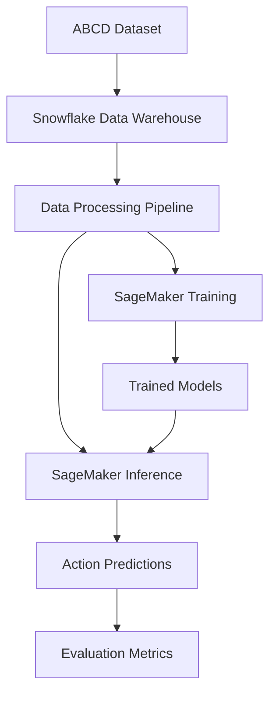

# ABCD サポート担当コパイロット PoC 技術仕様書

## システム概要

### アーキテクチャ概要

ABCD データセットを活用したサポート担当コパイロットシステムは、以下の3層アーキテクチャで構成されます：

1. **データ層** (Snowflake): ABCDデータの格納・前処理・特徴量生成
2. **機械学習層** (Amazon SageMaker): アクション推論モデルの学習・推論
3. **アプリケーション層** (Python): データ処理・評価・結果出力



### 技術スタック

| 層 | 技術要素 | 目的 |
|---|----------|------|
| **データ基盤** | Snowflake | データウェアハウス・SQL処理 |
| **ML/LLM** | Amazon SageMaker | モデル学習・推論・管理 |
| **データ処理** | pandas, numpy | データ前処理・特徴量生成 |
| **深層学習** | PyTorch, Transformers | LLMモデル実装・ファインチューニング |
| **評価・可視化** | scikit-learn, matplotlib | モデル評価・結果可視化 |
| **開発環境** | Jupyter Notebook | プロトタイピング・実験 |

## データ仕様

### ABCDデータセット構造

ABCD (Action-Based Conversations Dataset) は以下の構造を持ちます：

#### 主要データフィールド

| フィールド名 | データ型 | 説明 | 例 |
|-------------|----------|------|-----|
| `conversation_id` | String | 対話の一意識別子 | "abcd_001" |
| `turn_id` | Integer | 対話内のターン番号 | 1, 2, 3, ... |
| `speaker` | String | 発話者 (customer/agent) | "customer", "agent" |
| `utterance` | String | 発話内容 | "I want to cancel my subscription" |
| `action` | String | エージェントが取るべきアクション | "verify_account" |
| `action_label` | String | アクションの詳細ラベル | "request_verification" |
| `slots` | JSON | アクションに必要なスロット情報 | {"account_id": "12345"} |
| `intent` | String | ユーザーの意図 | "cancel_subscription" |
| `scenario` | String | 対話シナリオ | "subscription_management" |

#### データ分割

- **学習用**: 全データの70% (約7,000対話)
- **検証用**: 全データの15% (約1,500対話)
- **テスト用**: 全データの15% (約1,500対話)

### Snowflakeスキーマ設計

#### 1. 生データテーブル (`ABCD_RAW`)

```sql
CREATE TABLE ABCD_RAW (
    conversation_id VARCHAR(50),
    turn_id INTEGER,
    speaker VARCHAR(20),
    utterance TEXT,
    action VARCHAR(100),
    action_label VARCHAR(100),
    slots VARIANT,
    intent VARCHAR(100),
    scenario VARCHAR(100),
    created_at TIMESTAMP_NTZ DEFAULT CURRENT_TIMESTAMP(),
    PRIMARY KEY (conversation_id, turn_id)
);
```

#### 2. 前処理済みテーブル (`ABCD_PROCESSED`)

```sql
CREATE TABLE ABCD_PROCESSED (
    conversation_id VARCHAR(50),
    turn_id INTEGER,
    dialogue_history TEXT,
    current_utterance TEXT,
    target_action VARCHAR(100),
    target_action_label VARCHAR(100),
    context_features VARIANT,
    data_split VARCHAR(10), -- 'train', 'val', 'test'
    processed_at TIMESTAMP_NTZ DEFAULT CURRENT_TIMESTAMP(),
    PRIMARY KEY (conversation_id, turn_id)
);
```

#### 3. 特徴量テーブル (`ABCD_FEATURES`)

```sql
CREATE TABLE ABCD_FEATURES (
    conversation_id VARCHAR(50),
    turn_id INTEGER,
    turn_count INTEGER,
    dialogue_length INTEGER,
    intent_progression ARRAY,
    action_sequence ARRAY,
    feature_vector VARIANT,
    created_at TIMESTAMP_NTZ DEFAULT CURRENT_TIMESTAMP(),
    PRIMARY KEY (conversation_id, turn_id)
);
```

## 機械学習仕様

### タスク定義

#### 1. Action State Tracking
- **入力**: 対話履歴（直近N=5ターン）
- **出力**: 次に取るべきアクション + 信頼度スコア
- **評価指標**: Accuracy, F1-score, Top-k Accuracy

#### 2. システム応答生成 (Optional)
- **入力**: アクション + 対話文脈
- **出力**: エージェントの応答文
- **評価指標**: BLEU, ROUGE, 人手評価

### モデルアプローチ

#### Phase 1: プロンプトベースアプローチ

**モデル**: GPT-3.5/4, Claude, Llama 2/3等の事前学習済みLLM

**プロンプト設計例**:
```
You are a customer support agent. Based on the conversation history, predict the next action to take.

Conversation History:
Customer: I want to cancel my subscription
Agent: I can help you with that. Let me verify your account first.
Customer: My email is john@example.com

Available Actions:
- verify_account: Verify customer identity
- process_cancellation: Process subscription cancellation  
- request_information: Request additional information
- escalate_to_supervisor: Escalate to supervisor

Next Action:
```

#### Phase 2: 軽量ファインチューニング

**ベースモデル**: Llama 2-7B, Mistral-7B等
**手法**: LoRA (Low-Rank Adaptation)
**パラメータ**:
- LoRA rank: 16
- LoRA alpha: 32
- Learning rate: 1e-4
- Batch size: 8

### 入出力仕様

#### 推論API仕様

**エンドポイント**: `/predict_action`

**リクエスト**:
```json
{
  "conversation_id": "abcd_001",
  "dialogue_history": [
    {
      "speaker": "customer",
      "utterance": "I want to cancel my subscription",
      "timestamp": "2025-07-27T10:00:00Z"
    },
    {
      "speaker": "agent", 
      "utterance": "I can help you with that. Let me verify your account first.",
      "timestamp": "2025-07-27T10:00:30Z"
    }
  ],
  "current_utterance": "My email is john@example.com",
  "model_config": {
    "temperature": 0.1,
    "max_tokens": 100
  }
}
```

**レスポンス**:
```json
{
  "predicted_action": "verify_account",
  "confidence_score": 0.95,
  "action_details": {
    "action_label": "request_verification",
    "required_slots": ["email", "account_id"],
    "next_steps": ["Verify email address", "Confirm account details"]
  },
  "alternative_actions": [
    {
      "action": "request_information",
      "confidence": 0.85
    }
  ],
  "processing_time_ms": 150
}
```

## 評価フレームワーク

### 評価指標

#### 1. アクション予測精度
- **Accuracy**: 正解アクションの予測精度
- **Top-k Accuracy**: 上位k個の予測に正解が含まれる精度
- **Macro F1-score**: クラス不均衡を考慮したF1スコア
- **Cohen's Kappa**: 偶然の一致を除外した予測精度

#### 2. 対話レベル評価
- **Dialogue Success Rate**: 対話全体でのゴール達成率
- **Turn-level Accuracy**: ターン毎の予測精度
- **Action Sequence Similarity**: 予測アクションシーケンスの類似度

#### 3. 効率性評価
- **Response Time**: 推論処理時間
- **Throughput**: 1秒あたりの処理件数
- **Cost per Inference**: 推論1回あたりのコスト

### 実験設定

#### ベースライン手法
1. **Random Baseline**: ランダムなアクション選択
2. **Most Frequent**: 最頻出アクションの選択
3. **Rule-based**: ルールベースの意図・アクション対応

#### 提案手法
1. **Prompt-based LLM**: プロンプトエンジニアリング
2. **Few-shot Learning**: 数例の学習例を用いた推論
3. **Fine-tuned Model**: LoRAによる軽量ファインチューニング

### 評価プロトコル

#### データ分割
- **学習**: 70% (クロスバリデーション用)
- **検証**: 15% (ハイパーパラメータ調整用)
- **テスト**: 15% (最終評価用)

#### 評価手順
1. **学習フェーズ**: 学習データでモデル訓練/プロンプト最適化
2. **検証フェーズ**: 検証データでハイパーパラメータ調整
3. **テストフェーズ**: テストデータで最終性能評価
4. **統計的検定**: 有意差検定による性能比較

## 性能要件

### 精度要件
- **最低要件**: Action State Tracking精度 50%以上
- **目標**: Action State Tracking精度 70%以上
- **理想**: Human-level performance (80%以上)

### 非機能要件
- **レスポンス時間**: 平均 < 500ms, 95%ile < 1秒
- **スループット**: > 100 requests/sec
- **可用性**: 99.9% (PoC期間中)

### リソース制約
- **GPU使用量**: 学習時 < 4 GPU時間/日
- **ストレージ**: < 100GB (Snowflake)
- **コンピュート**: < $500/月 (AWS SageMaker)

## セキュリティ・プライバシー

### データ保護
- **データ暗号化**: 保存時・転送時の暗号化
- **アクセス制御**: IAMによる最小権限アクセス
- **監査ログ**: 全データアクセスの記録

### プライバシー配慮
- **データ匿名化**: 個人識別情報の除去・仮名化
- **データ保持期間**: PoC終了後30日で削除
- **第三者共有**: 禁止

## 運用・監視

### モニタリング項目
- **モデル性能**: 精度・レスポンス時間の監視
- **データ品質**: 入力データの異常検知
- **システム負荷**: CPU・メモリ・ネットワーク使用率

### アラート設定
- **精度低下**: 精度が閾値(40%)を下回った場合
- **エラー率**: エラー率が5%を超えた場合
- **レスポンス遅延**: 平均レスポンス時間が1秒を超えた場合

### ログ管理
- **アプリケーションログ**: 推論処理・エラー情報
- **アクセスログ**: API呼び出し履歴
- **監査ログ**: データアクセス・モデル更新履歴

## 拡張性・保守性

### スケーラビリティ
- **水平スケーリング**: SageMaker Endpointの自動スケーリング
- **データパーティショニング**: 時系列・地域別でのデータ分割
- **モデルバージョニング**: A/Bテスト対応

### 保守性
- **コード品質**: Black・Flake8による自動チェック
- **テストカバレッジ**: 80%以上のテストカバレッジ
- **ドキュメント**: 自動生成ドキュメント・運用手順書

### 将来拡張
- **多言語対応**: 日本語・英語以外の言語サポート
- **リアルタイム学習**: オンライン学習による性能向上
- **マルチモーダル**: 音声・画像データの統合処理 